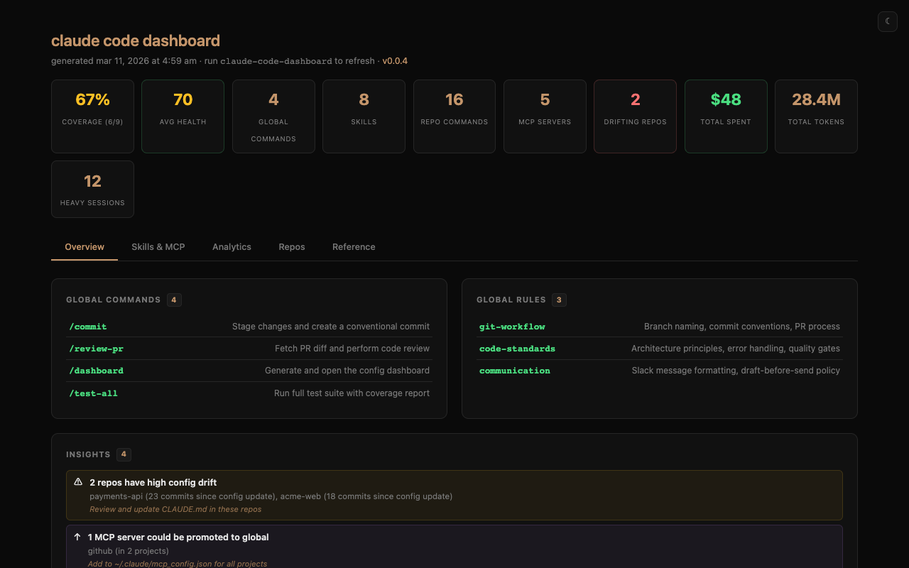
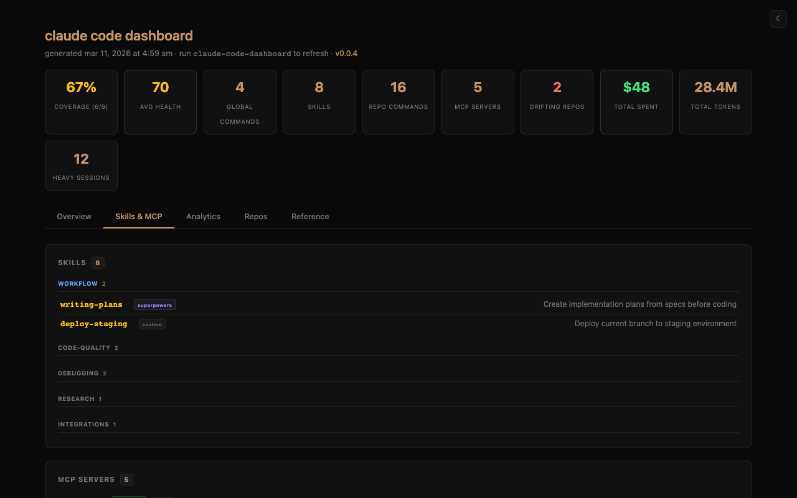
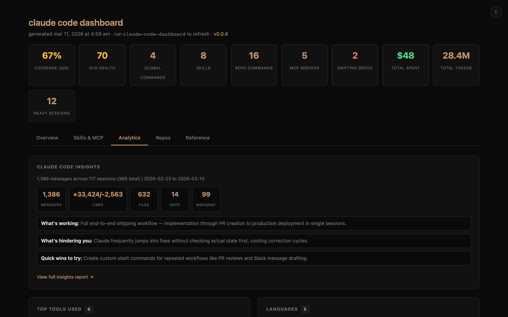
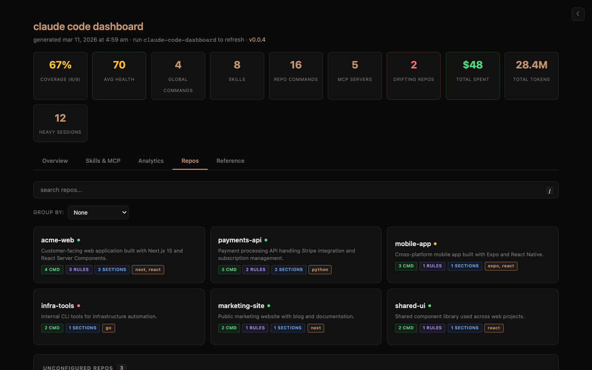
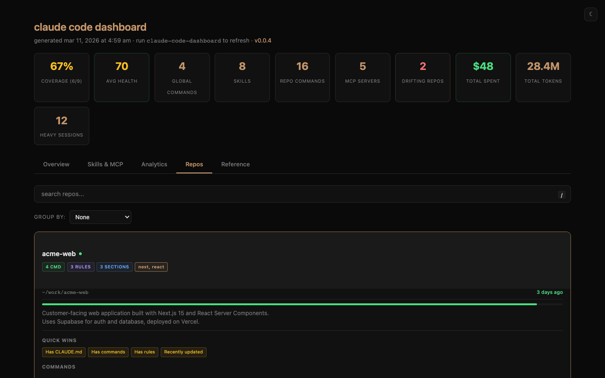
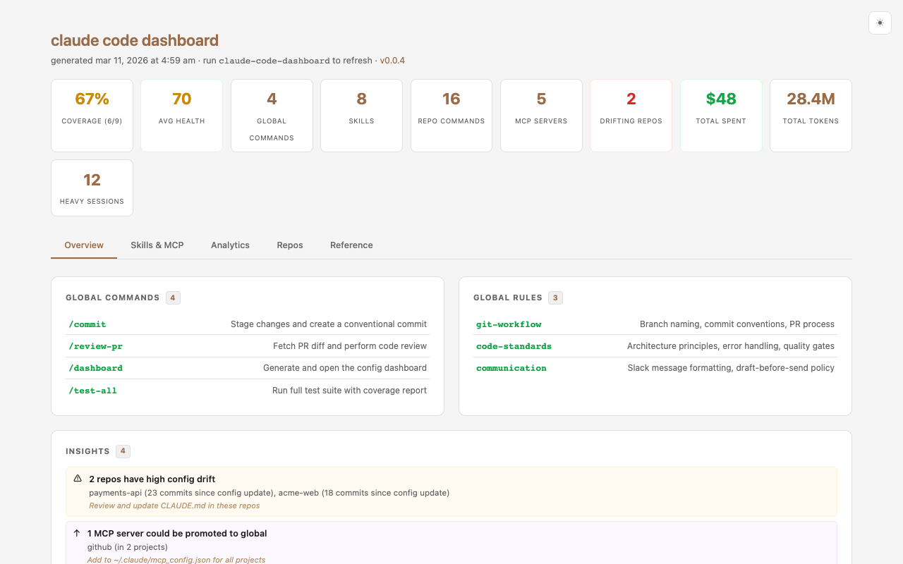

# claude-code-dashboard

[](https://www.npmjs.com/package/@viren/claude-code-dashboard)
[](https://github.com/VirenMohindra/claude-code-dashboard/actions/workflows/ci.yml)
[](https://opensource.org/licenses/MIT)
[](https://nodejs.org)

A visual dashboard for your [Claude Code](https://docs.anthropic.com/en/docs/claude-code) configuration across all repos.

Scans your home directory for git repos, collects Claude Code configuration (commands, rules, skills, MCP servers, usage data), and generates a self-contained HTML dashboard.

## Screenshots

### Dashboard overview — stats, global commands, and rules



### Skills with auto-categorization and MCP server discovery



### Usage analytics — tool usage, languages, activity heatmap



### Repo cards with search, grouping, and consolidation hints



### Expanded repo — commands, rules, health score, matched skills



### Light mode



> Screenshots generated with `claude-code-dashboard --demo`

## Features

### Core

- **Repo discovery** — finds all git repos under `$HOME` (or configured directories)
- **Config coverage** — shows what percentage of your repos have Claude Code configuration
- **Freshness indicators** — green/yellow/red dots showing how recently config was updated
- **Expandable cards** — collapsed 3-column grid, click to expand full details
- **Search** — filter repos by name, path, or content (`/` to focus, `Esc` to clear)
- **Group by** — organize repos by tech stack or parent directory
- **Light/dark mode** — toggle with system preference detection

### Intelligence

- **Health scores** — 0-100 config completeness score per repo with quick-win suggestions
- **Tech stack detection** — auto-detects Next.js, React, Python, Go, Rust, Swift, Expo, etc.
- **Drift detection** — flags repos where config is stale relative to code churn
- **Config patterns** — detects modular, monolithic, command-heavy, or minimal styles
- **Cross-repo similarity** — finds repos with similar configs for consolidation
- **Repo-to-skill matching** — shows relevant skills per repo based on tech stack

### Skills

- **Skills dashboard** — scans `~/.claude/skills/` with source detection (superpowers, skills.sh, custom)
- **Auto-categorization** — groups skills by type (workflow, debugging, research, etc.)
- **Skill catalog** — shareable HTML page with install hints (`--catalog`)

### MCP Servers

- **MCP discovery** — scans `~/.claude/mcp_config.json` and per-repo `.mcp.json` files
- **Promotion hints** — flags servers installed in 2+ projects but not globally
- **Disabled server detection** — reads `~/.claude.json` for disabled servers
- **Historical tracking** — shows former MCP servers no longer in use

### Usage Analytics

- **Activity heatmap** — GitHub-style daily activity grid
- **Top tools & languages** — bar charts from session metadata
- **Peak hours** — when you use Claude Code most
- **Model usage & cost** — token breakdown by model (via [ccusage](https://github.com/ryoppippi/ccusage))

### CLI

- **Config templates** — `init` scaffolds CLAUDE.md based on your best existing configs
- **Config linting** — `lint` detects TODO markers, missing CLAUDE.md, empty configs
- **Watch mode** — `--watch` regenerates on file changes
- **Diff view** — `--diff` shows what changed since last generation
- **JSON export** — `--json` dumps the full data model for downstream tooling
- **Anonymized export** — `--anonymize` replaces paths for safe sharing
- **Shell completions** — `--completions` for bash/zsh

### Other

- **Dependency chains** — visualize repo relationships via config file
- **Quick reference** — built-in card with slash commands, tools, and keyboard shortcuts
- **Zero dependencies** — pure Node.js, no `npm install` required

## Install

```sh
npm install -g @viren/claude-code-dashboard
```

Or run directly:

```sh
npx @viren/claude-code-dashboard
```

Or clone and run:

```sh
git clone https://github.com/VirenMohindra/claude-code-dashboard.git
node claude-code-dashboard/generate-dashboard.mjs
```

## Usage

```sh
# Generate dashboard (writes to ~/.claude/dashboard.html)
claude-code-dashboard

# Generate and open in browser
claude-code-dashboard --open

# Watch mode — regenerate on file changes
claude-code-dashboard --watch

# Custom output path
claude-code-dashboard --output ~/Desktop/dashboard.html

# Export as JSON
claude-code-dashboard --json

# Generate skill catalog
claude-code-dashboard --catalog

# Show diff since last generation
claude-code-dashboard --diff

# Anonymize paths for sharing
claude-code-dashboard --anonymize

# Scaffold CLAUDE.md for current repo
claude-code-dashboard init

# Preview without writing
claude-code-dashboard init --dry-run

# Lint all repo configs
claude-code-dashboard lint

# Shell completions
claude-code-dashboard --completions >> ~/.zshrc
```

### As a Claude Code slash command

Create `~/.claude/commands/dashboard.md` with:

<!-- prettier-ignore-start -->
```text
# Dashboard

Generate and open the Claude Code configuration dashboard.

## Steps

1. Run the dashboard generator:
   npx @viren/claude-code-dashboard --open --quiet
```
<!-- prettier-ignore-end -->

Then run `/dashboard` from any Claude Code session.

## Configuration

Create `~/.claude/dashboard.conf` to customize behavior:

<!-- prettier-ignore-start -->
```text
# Restrict scanning to specific directories (one per line):
~/work
~/personal/repos

# Define dependency chains:
chain: ui-library -> app -> deploy
chain: backend <- shared-types
```
<!-- prettier-ignore-end -->

If no directories are listed, the entire home directory is scanned (depth 5).

## What it scans

| Path                                 | What it shows                        |
| ------------------------------------ | ------------------------------------ |
| `CLAUDE.md` / `AGENTS.md`            | Project description, config sections |
| `.claude/commands/*.md`              | Custom slash commands                |
| `.claude/rules/*.md`                 | Custom rules                         |
| `.mcp.json`                          | Project MCP server config            |
| `package.json`                       | Tech stack detection                 |
| `~/.claude/commands/*.md`            | Global commands                      |
| `~/.claude/rules/*.md`               | Global rules                         |
| `~/.claude/skills/*/SKILL.md`        | Skills (with source detection)       |
| `~/.claude/mcp_config.json`          | Global MCP server config             |
| `~/.claude.json`                     | Disabled MCP servers                 |
| `~/.claude/usage-data/session-meta/` | Usage analytics                      |
| `~/.claude/stats-cache.json`         | Activity heatmap data                |

## Requirements

- Node.js 18+
- Git (for freshness timestamps and drift detection)

## Privacy

The generated HTML file contains:

- Filesystem paths (shortened with `~`)
- Preview lines from your `CLAUDE.md` / `AGENTS.md` files
- Names of your commands, rules, and MCP servers
- Usage statistics (tool counts, languages, activity patterns)

The file is local-only and never sent anywhere. Use `--anonymize` to strip identifying paths before sharing.

## License

MIT
