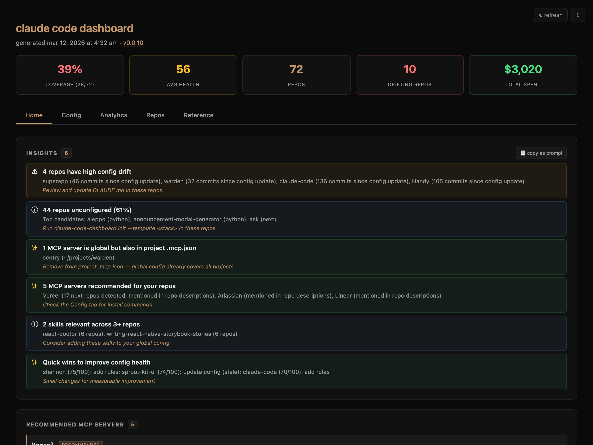
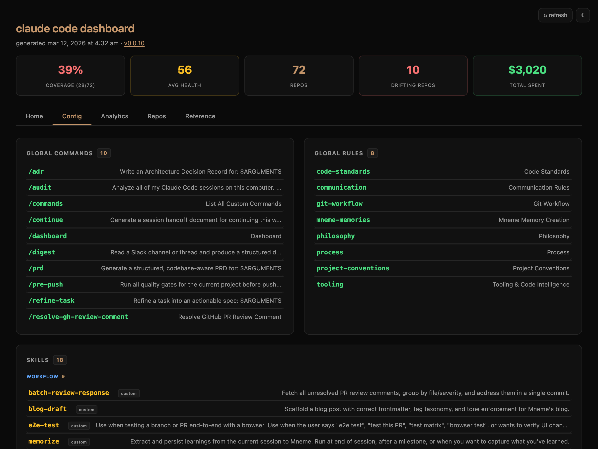
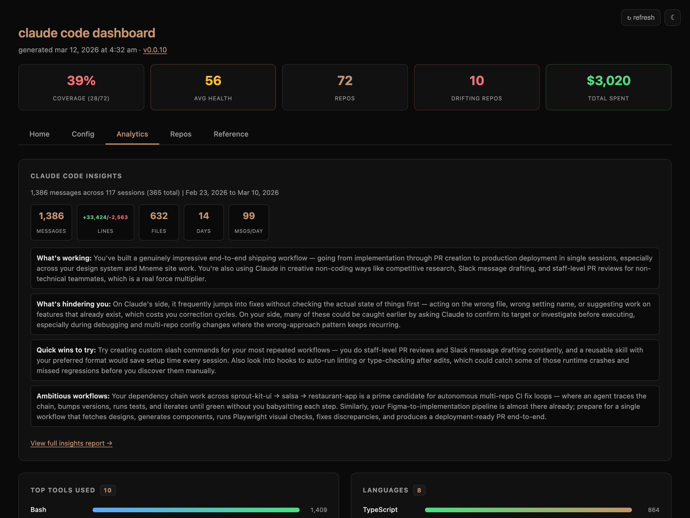
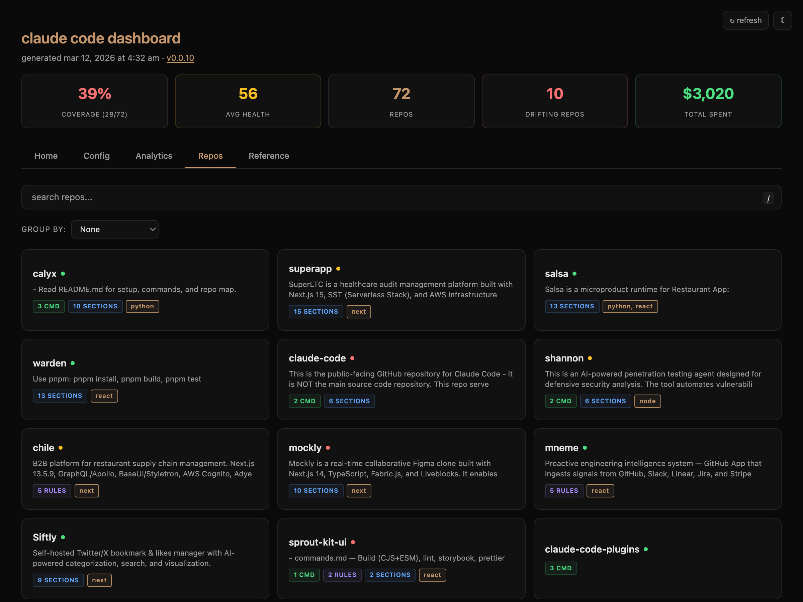
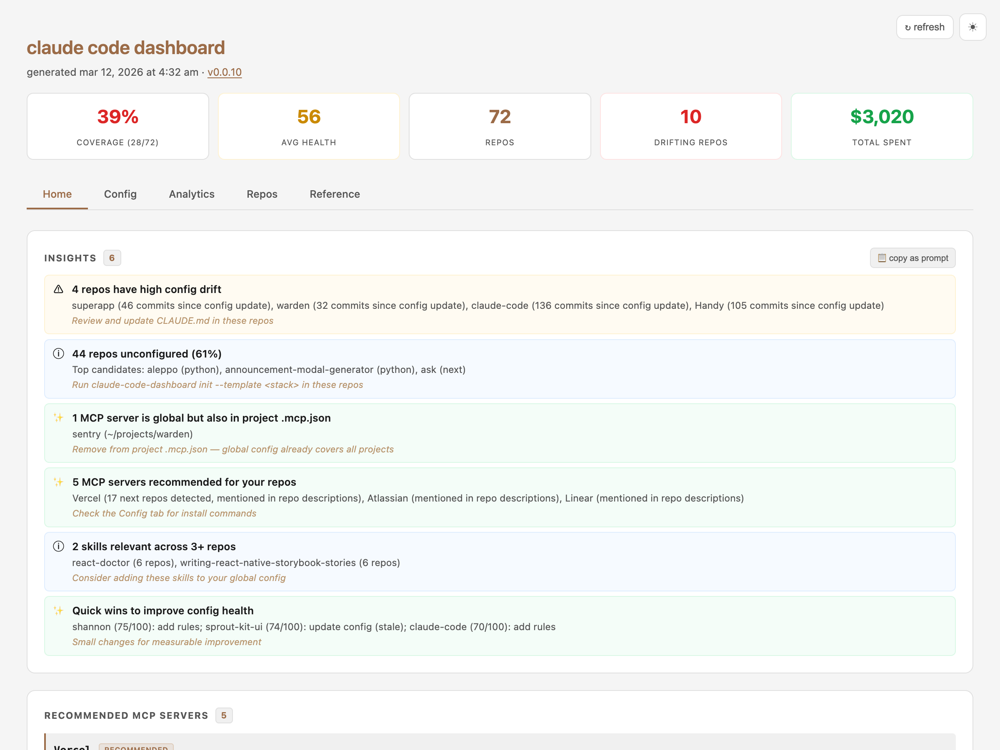

# claude-code-dashboard

[](https://www.npmjs.com/package/@viren/claude-code-dashboard)
[](https://github.com/VirenMohindra/claude-code-dashboard/actions/workflows/ci.yml)
[](https://opensource.org/licenses/MIT)

See everything about your [Claude Code](https://docs.anthropic.com/en/docs/claude-code) setup in one place — what's configured, what's drifting, and what to do next.

```sh
npx @viren/claude-code-dashboard --open
```

**[Live Demo](https://virenmohindra.me/claude-code-dashboard/)**



## What it does

Scans your machine for git repos, collects all Claude Code configuration (commands, rules, skills, MCP servers, usage data), and generates a self-contained HTML dashboard. No server, no account, no dependencies.

The **Home** tab tells you what needs attention — config drift, recommended MCP servers, quick wins. The **Config** tab shows your full setup. **Analytics** visualizes how you use Claude Code. **Repos** gives a searchable grid of every project.

<details>
<summary>More screenshots</summary>

### Config — commands, rules, skills, MCP servers



### Analytics — tools, languages, activity heatmap, cost



### Repos — searchable grid with health scores



### Light mode



</details>

## Install

```sh
npm install -g @viren/claude-code-dashboard
```

Or run directly with `npx @viren/claude-code-dashboard`.

## Usage

```sh
# Generate and open in browser
claude-code-dashboard --open

# Watch mode — regenerate on config changes
claude-code-dashboard --watch

# Scaffold CLAUDE.md for the current repo
claude-code-dashboard init

# Lint all repo configs
claude-code-dashboard lint
```

### As a slash command

Create `~/.claude/commands/dashboard.md`:

<!-- prettier-ignore-start -->
```text
# Dashboard

Generate and open the Claude Code configuration dashboard.

## Steps

1. Run the dashboard generator:
   npx @viren/claude-code-dashboard --open --quiet
```
<!-- prettier-ignore-end -->

Then run `/dashboard` from any Claude Code session.

<details>
<summary>All CLI flags</summary>

```sh
claude-code-dashboard --output ~/path.html   # Custom output path
claude-code-dashboard --json                  # Export data as JSON
claude-code-dashboard --catalog               # Generate shareable skill catalog
claude-code-dashboard --diff                  # Show changes since last run
claude-code-dashboard --anonymize             # Strip paths for safe sharing
claude-code-dashboard --offline               # Skip MCP registry fetch
claude-code-dashboard --demo                  # Generate with sample data
claude-code-dashboard --completions >> ~/.zshrc  # Shell completions
claude-code-dashboard init --dry-run          # Preview config scaffold
```

</details>

## Configuration

Create `~/.claude/dashboard.conf` to control scanning:

<!-- prettier-ignore-start -->
```text
# Restrict to specific directories (one per line):
~/work
~/personal/repos

# Define dependency chains:
chain: ui-library -> app -> deploy
chain: backend <- shared-types
```
<!-- prettier-ignore-end -->

Without this file, the entire home directory is scanned (depth 5).

## Key features

- **Insights** — actionable findings with "copy as prompt" to paste directly into Claude Code
- **Health scores** — 0-100 config completeness per repo with specific improvement suggestions
- **MCP recommendations** — suggests servers from the Anthropic registry based on your tech stacks
- **Drift detection** — flags repos where config hasn't been updated in many commits
- **Tech stack detection** — auto-detects Next.js, React, Python, Go, Rust, Expo, etc.
- **Usage analytics** — activity heatmap, top tools, peak hours, model costs (via [ccusage](https://github.com/ryoppippi/ccusage))
- **Skill catalog** — shareable HTML page of your skills with install hints
- **Zero dependencies** — pure Node.js 18+, no `npm install` required

## Privacy

Everything stays local. The generated HTML is a self-contained file that is never sent anywhere. Use `--anonymize` to strip paths before sharing.

## License

MIT
